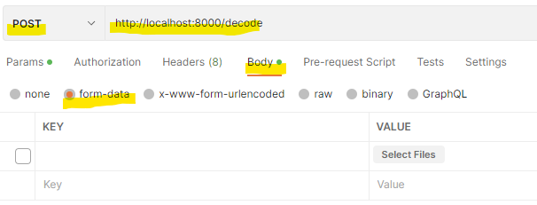
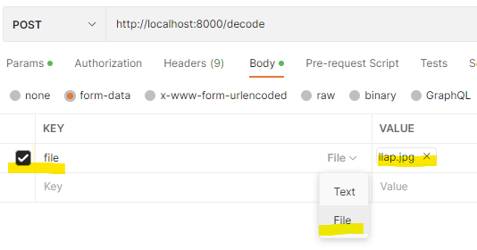

# stereogram-decoder

Experimental [autostereogram](https://en.wikipedia.org/wiki/Autostereogram) ("magic image") decoder in python using OpenCV.


## Getting Started

Requires docker.
Postman or similar recommended.

Clone the project:

```bash
git clone https://github.com/nitrovent/stereogram-decoder.git
cd stereogram-decoder
```

Start the app:

```bash
docker-compose up --build
```

The app is now available at `http://localhost:8000`.
There is an endpoint `/decode` that accepts a `POST` with a form-data payload.
It takes the first file in the payload, decodes it and returns the depth map image.

In Postman:



Then add a key `file` with type `File`and select an image that contains the stereogram to decode.

Use an image search for `stereogram` or `magic image` to find examples.



Now click `Send` and the depth map will show in the response Body tab.

## How does it work?

The app uses OpenCV's StereoSGBM to retrieve the depth information from the image.

This algorithm is often used in depth estimation for stereo vision and tries to match small blocks of one image in a stereo pair within a certain window in the other image of the stereo pair.

The further apart the blocks are, the nearer the part represented by the block was to the viewer.

See also Wikipedia on [Autostereograms](https://en.wikipedia.org/wiki/Autostereogram) for an explanation of stereograms and the basic idea how to decode them.

As there is only a single image in autostereograms, they are perfectly aligned compared to two images from two cameras.
